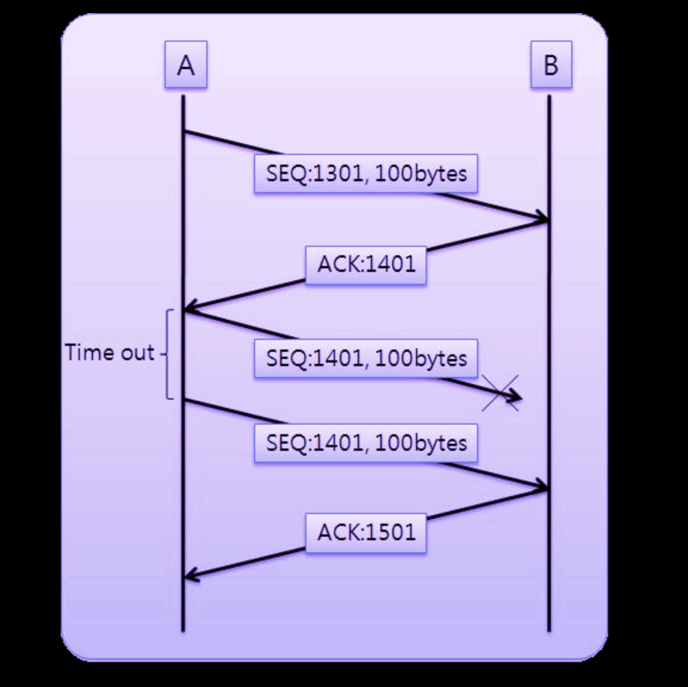
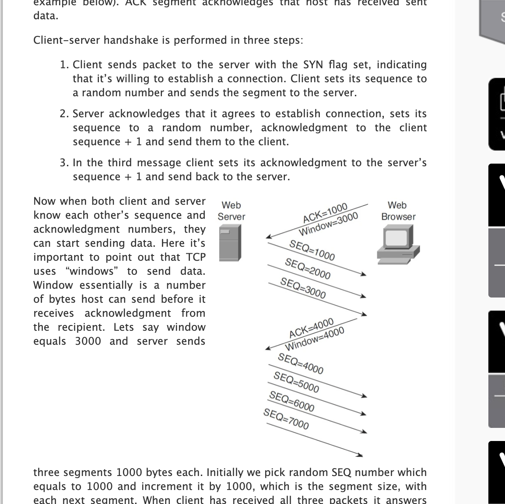

# TCP 서버 클라이언트.

- 수신할 데이터의 크기를 파악하는것이 힘들 때 어떻게 구현 해야 하는가 ?
    - 이럴때 필요한 겂이 어플리케이션 프로토콜의 정의.
    - 데이터의 송수신 과정에서 데이터의 끝을 알 수 있는 약속을 별도로 정의해야 한다.
    - 데이터의 끝을 표현해놓거나, 송수신될 데이터의 크기를 미리 알려준다던지 해야한다.

- 계산기 서버/클라이언트 예제를 만들어보자.

- 프로토콜 정의
    - 클라이언트는 서버에 접속하자 마자 피연산자의 개수 정보를 1바이트 정수형태로 전달
    - 클라이언트가 서버에 전달하는 정수 하나는 4바이트로 표현한다.
    - 정수를 전달할 때에는 연산의 종류를 전달한다. 연산정보는 1바이트로 전달한다.
    - 문자 +, -, * 중 하나를 선택해서 전달한다.
    - 서버는 연산결과를 4바이트 정수의 형태로 클라이언트에게 전달한다.
    - 연산결과를 얻은 클라이언트는 서버와의 연결을 종료한다.


### 배열, 포인터 in tcp

- 하나의 배열에 다양한 자료를 넣어 처리하기 위해서는
    - char 배열이 많이 사용된다(1바이트여서)

- 예를들어 `char msg[1024]`로 선언하면 0~1023의 총 1024개의 1바이트 배열이 생기는데..
- 여기다가 내가 4바이트 정수형을 우겨넣고 싶다면..

```c
#define SZ 4 //int 4bytes

int main(){
    char msg[1024];
    *(int *)&msg[0] = 23453;
    for (int i = 0; i = 5; i ++){
        *(int *)&msg[i*SZ] = 123445;
    }
}
```

- 이렇게 포인터 형변환을 해서 우겨넣어주면 된다 ㅋㅋ TCP 코딩에서 자주 사용하는 기법인가 봄.


### TCP의 이론적인 이야기.

- TCP 소켓의 데이터 송수신에는 경계가 없다.
- 서버가 40bytes를 write해서 보내도 클라이언트는 네번의 read 함수 호출을 통해 10바이트씩 수신도 가능하다.
- write()함수를 호출하는 순간이 데이터가 전송되는 순간이 아니고, read를 호출하는 순간이 데이터가 수신되는 순간이 아니다.
- write()함수가 호출되는 순간 데이터는 출력 버퍼로 이동, read()함수가 출력되는 순간 데이터는 입력버퍼에 저장된 데이터를 읽어들이게 됨.

### TCP의 내부 동작 원리 1: 상대 소켓과의 연결
- TCP 소켓의 생성에서 소멸의 과정까지 거치게 되는 일을 크게 나누면, 다음 세가지로 구분할 수 있다.
    - 상대 소켓과의 연결
    - 상대 소켓과의 데이터 송수신
    - 상대 소켓과의 연결 종료

- 연결 설정 과정에서 두 소켓이 주고받는 대화의 내용
    - (Shak1) 소켓 A: 연결을 요청할게
    - (Shak2) 소켓 B: 나는 Listen 하고있으니 언제든 괜찮다
    - (Shak3) 소켓 A: Thank you 
- 실제 TCP 소켓은 연결과정에서 총 세번의 대화를 주고 받는다.
    - 이것을 3 way handshaking 이라고 한다.
- 소켓은 전 이중 방식으로 동작하므로 양방향으로의 데이터를 주고 받을 수 있다.
- 따라서 데이터 송수신에 앞서 준비과정이 필요하다.
- 먼저 연결요청을 하는 호스트 A가 호스트에게 다음 메시지를 전달한다

- (SYN) SEQ:1000, ACK: -
    - 이것은 SEQ가 1000, ACK는 비어있음을 의미한다.
    - SEQ 1000이 의미하는 바는 다음과 같다.
        - 내가 지금 보내는 이 패킷에 1000이라는 번호를 부여하니까, 잘 받았으면 다음에 1001번 패킷을 전달하라고 나한테 말해줘
    - 이것은 처음 연결 요청에 사용되는 매시지이기 때문에 이 메시지를 가르켜 SYN이라고 한다 동기화 메시지라는 의미를 갖고있다.
- 이어서 호스트 B가 호스트 A에게 다음 메시지를 전달한다.
    - (SYN + ACK) SEQ:2000, ACK:1001
    - 이는 SEQ가 2000, ACK가 1001임을 의미하고, 여기서 SEQ 2000이 의미하는 바는 다음과 같다
        - 내가 지금 보내는 이 패킷에 2000번 번호를 부여하니, 잘 받았다면 다음에 2001번 패킷을 전달하라고 말해줘
    - ACK: 1001이 의미하는 것은 SEQ가 1000인 패킷은 잘 받았고, 다음번에는 SEQ가 1001인 패킷을 전송해라

- 마지막으로 호스트 A가 호스트 B에게 메시지를 전송한다
    - (ACK) SEQ:1001, ACK:2001
        - SEQ가 2000인 패킷은 잘 받았고, 다음번에는 SEQ가 2001인 패킷을 전송해라

### TCP의 내부 동작원리2: 상대 소켓과의 데이터 송수신
- 처음으로 진행한 3-way handshaking을 통해서 데이터 송수신 준비가 끝났으니, 이제 본격적으로 데이터를 송수신할 차례가 됨



- 호스트 A가 호스트 B에게 100바이트씩 데이터를 총 두번에 나눠서 전송하는 그림이다.
- 호스트 A가 100바이트의 데이터를 패킷 하나에 실어서 전송하였는데, 패킷의 SEQ를 1301로 정의했다. 
- 100bytes의 데이터를 B에게 보내고,  B는 잘 받았으면 ACK를 1401을 던져준다. 다음에 받을 SEQ번호를 던져준다고 생각하면 된다.
- 이 때 SEQ 1401부터 100바이트를 보냈는데, B로부터 응답이 없다면 time-out 및 재전송을 시도한다.
- 이 때 B가 받았으면 ACK 1501을 리턴한다.
- 이와 같이 ACK를 이용해 신뢰성 있는 연결을 하는 것이라고 보면 됨
    - 추가로 볼 점은 time-out 시간을 정의하는 알고리즘이 별도로 있다는 것(저거에 따라 응답 속도차이가 날 수 있으니까)
    - 또한, window 개념도 존재하는데, ACK를 리턴해줄 때 window 사이즈도 리턴해준다, 그럼 A가 보낼때 window의 크기만큼 바이트 스트림으로 쭉 밀어준다. 
    - window를 설정하는 알고리즘 또한 존재한다. 보통은 처음에 기하급수적으로 window 사이즈를 증가시켰다가. 나중에는 천천히 증가시키고, 3 dup 발생할 경우 window 사이즈를 1/2를 한다.
    



- window에 대한 개념.

- 혼잡 회피 기법으로서 slow start를 조만간 구현해보기 !
